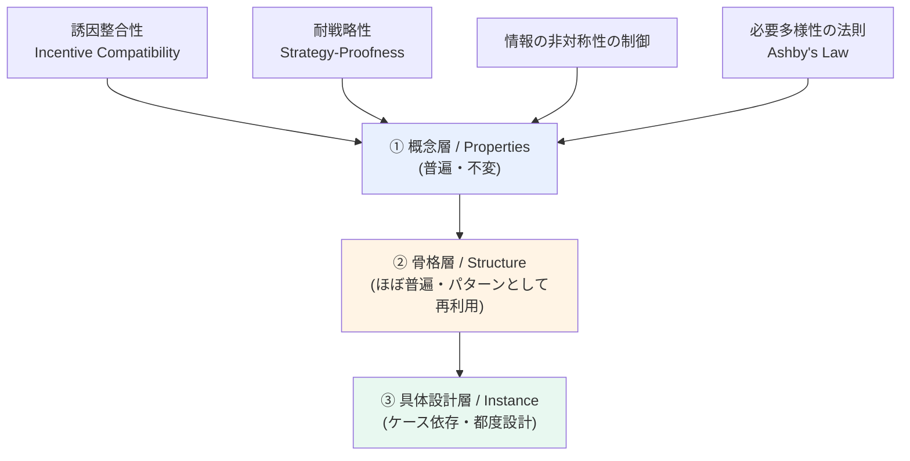
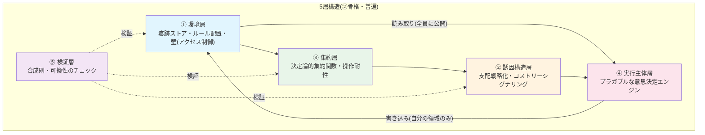
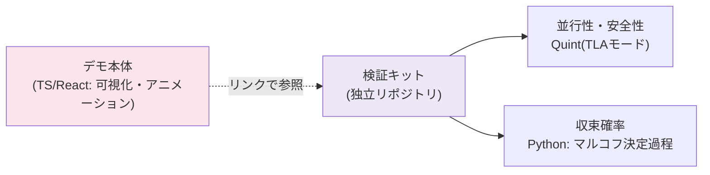

# 多主体系における非中央集権的協調のためのアーキテクチャ設計

## 全体の3階層構造

- **①概念層**: ゲーム理論・情報理論由来の"ものさし"。対象が何であれ変わらない。圏論はこの層の性質が②で壊れていないかを検証する言語として機能する(必要条件であり十分条件ではない、という限界込みで採用)。
- **②骨格層**: 下記5層構造。デザインパターンとして複数ケースに使い回す対象。
- **③具体設計層**: ケースごとの数式・アルゴリズム・データ構造。消耗品として割り切る。

---

## ②骨格層: 5層構造

### 各層の役割と、集権化を避けるための設計原則

| 層 | 役割 | 集権化させないための原則 |
|---|---|---|
| **環境層** | 痕跡の保存場所。ルールそのものも「低頻度更新の痕跡」として静的に配置 | 参加=読み取り行為に統一(特別な参加処理を作らない)。書き込みは自領域のみ(壁=射の制約) |
| **誘因構造層** | 正直な申告・行動が最適になるよう設計(支配戦略化) | ペナルティは「中央が下す」のではなく、痕跡として残り間接的に効く形にする |
| **集約層** | バラバラな情報を1つの結論に変換 | 決定論的関数を各エージェントが**ローカルに同じ計算**をする(中央が計算しない) |
| **実行主体層** | 意思決定ロジック本体 | ルールベース/最適化/LLMなど中身を差し替え可能(プラガブル)にしておく |
| **検証層** | 上記の合成が矛盾しないかを圏論的に確認 | 「これを止めたら全体が止まる」対象が圏の中に存在しないことを確認する |

---

## ③具体設計層: ケースごとに変わる部分(現時点の想定)

| 要素 | ケース1: タスク配分(1回性) | ケース2: 信用枠配分(時間発展) |
|---|---|---|
| 誘因構造の中身 | VCG的な支払い関数 | 繰り返しゲームの評判モデル |
| 集約の中身 | 最適マッチング/多数決 | 時系列の重み付き平均 |
| 環境(痕跡)の性質 | 短命(秒〜分、evaporation速い) | 長命(日〜月、積算的) |
| 想定される追加複雑性 | なし | 実行主体層の読み取りロジックが多少複雑化(堀のある建築の出入口、程度の波及) |

→ **層の数(5)は変えず、環境層内のデータ性質と各層内の数式だけがケース依存で変わる**、というのが現時点の仮説。2ケース目実装で検証。

---

## 評価・検証の位置づけ(①②とは別軸)

- デモ本体には**評価結果のサマリーのみ**を載せ、検証プロセス自体は独立資産として切り離す(ドメインが変わっても使い回せる「検証キット」として育てる)。

---

## 進め方のロードマップ(合意済み事項の整理)

1. **ケース1(タスク配分など、1回性の取引)** を5層構造の最小実装(薄く)で作る
   - Python: 環境層・誘因構造層・集約層・検証層(自作の軽量合成則チェッカー)
   - TypeScript/React: ワイヤリングダイアグラム風のアニメーションで可視化
   - 逸脱注入 → 同一ラウンド内の反実仮想比較(逸脱が得にならないことの直接実証)、の3シーン構成でデモ化(環境側の間接修正の物語は2ケース目=繰り返しゲームへ移設、`DECISIONS.md` D-07)
2. **ケース2(性質が大きく異なるもの、時間発展を含むもの)** を同じ5層構造に当てはめる
   - ここで「5層で足りたか、層が増えたか」を検証 → 骨格の再現性を確認
3. 2ケースの比較を「同じ骨格から出発して、複数ドメインに筋良く展開できる」という主張の実証として整理する

---

## 現時点で保留・注意している論点

- **①(骨格の普遍性)**: 概念(誘因整合性・耐戦略性等)は崩れないと予測。5層という"数・切り方"は2ケース目実装で調整が入る可能性あり(叩き台として妥当)。
- **必要多様性の法則の援用**: 数学的証明ではなく着想源としての比喩(その旨を明示して扱う)。
- **圏論の役割**: 安全性の証明ではなく、合成可能性・可換性の検証と可視化のための言語として限定的に使用。
- **逸脱モデル**: 初期デモは単純な逸脱パターンで十分。適応的な攻撃(LLM的な巧妙さ)への頑健性は別途の検討課題として明示しておく。
